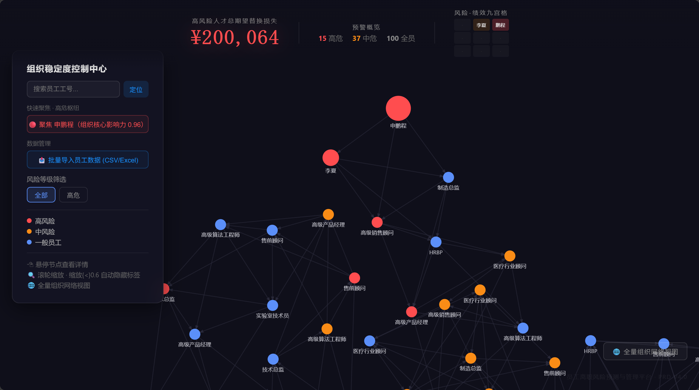
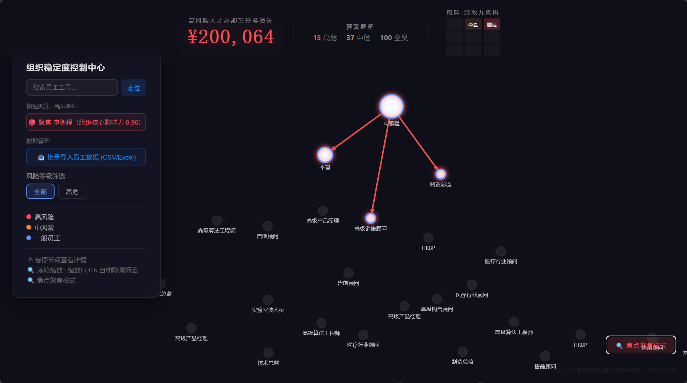
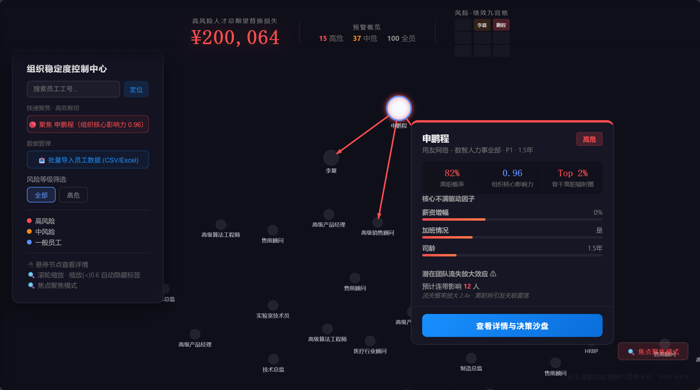
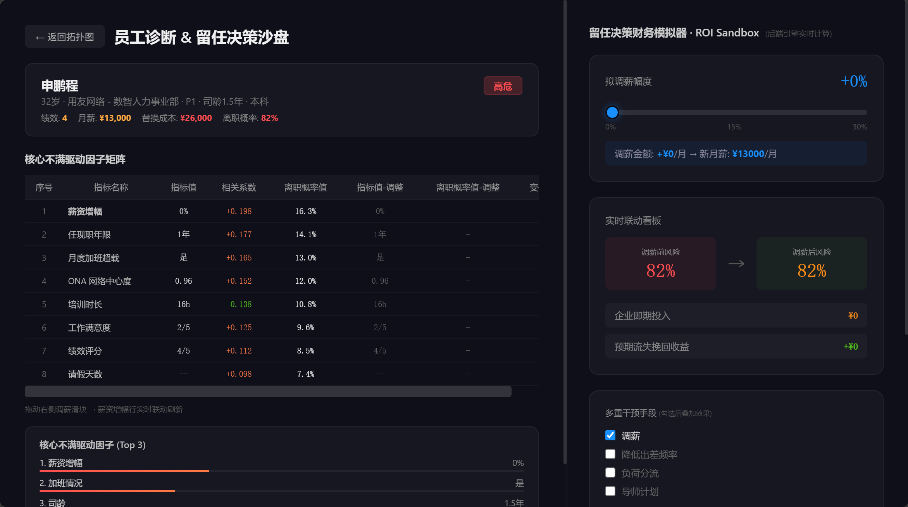
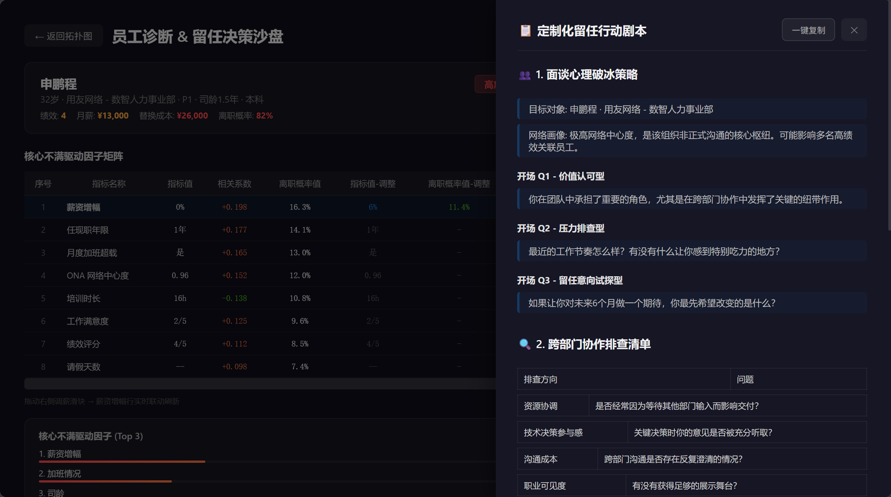
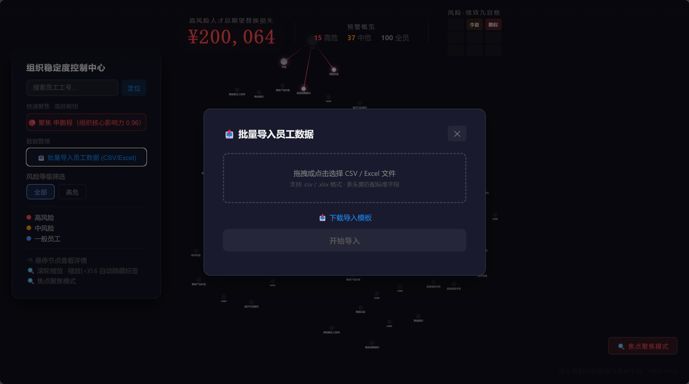

# 组织网络分析（ONA）与留任决策模拟平台

**员工离职风险预测与管理平台** · v0.3.0 · Demo-Ready


*① ONA 全局力导向拓扑图谱（AntV G6 · 100 节点） · ② 高风险人才总期望替换损失 ¥200,064 看板 · ③ 预警概览（高危 15 / 中危 37 / 全员 100） · ④ 风险-绩效九宫格 · ⑤ 组织稳定度控制中心（搜索 + 筛选 + 图例）*

> **不是另一个问卷平台。** 基于被动式组织网络分析（Passive ONA）的离职风险预测系统，为 HRBP 和 CHO 提供从"谁可能走"到"花多少钱留"的完整决策闭环。

[](http://localhost:8000/health)
[](http://localhost:5175)
[](docs/)

---

## 🚀 三秒冷启动

```bash
# 后端（FastAPI）
cd api
python -m uvicorn api.main:app --host 0.0.0.0 --port 8000

# 前端（React + Vite）
cd frontend
npm run dev -- --port 5175
```

浏览器打开 `http://localhost:5175`，即可看到拓扑图谱。

---

## 🧭 差异化定位

在 Workday Peakon / Visier / Glint / Culture Amp 四家巨头的竞争格局中，Turnover ONA 开辟了一个新品类：

| 维度 | 传统平台 | Turnover ONA |
|------|---------|-------------|
| 数据来源 | 员工主动填写问卷（Pulse Survey） | 被动分析协作日志元数据 |
| 核心洞察 | "谁不满意"（eNPS / 敬业度分数） | "谁是枢纽"（Eigenvector Centrality 0.96） |
| 归因粒度 | 群体级因子分析 | **个体级 SHAP 归因**（每人 Top 3 因子不同） |
| 财务语言 | "敬业度提升了 3 分" | **"调薪 10% → 净节约 ¥2,520"** |
| 员工负担 | 每周 3–5 分钟填问卷，响应率 30%→衰减 | **零负担**——不需任何操作 |
| 组织盲区 | 看不到非正式网络 | ONA 拓扑识别隐性权力中心 |

> 📄 详细分析见 [竞品分析报告](docs/product/competitive_analysis.md)


*高亮申鹏程（Eigenvector Centrality 0.96）及其一度邻居，非目标子图透明度降至 0.1，一步识别隐性权力中枢*


*悬停任意节点弹出详细诊断：离职概率、组织核心影响力、Top 3 核心不满驱动因子、潜在团队流失放大效应*

---

## 📐 系统架构

```
[HR 数据/CSV] → SHA-256 脱敏管道 → turnover.db (SQLite)
                                        ↓
                                ONA + SHAP 引擎
                                        ↓
            ┌─── 全局预警仪表盘（总期望替换损失 ¥200,064）
            ├─── ONA 拓扑图谱（AntV G6 · 焦点聚焦 · 60fps）
            ├─── 个体诊断面板（8 项 SHAP 因子 · 瀑布图）
            ├─── ROI 沙盘模拟器（滑块联动 · 100ms 节流 · 实时重算）
            ├─── PDF 留任建议书（归因 + ROI + 级联风险）
            └─── LLM 面谈剧本生成（Playbook Drawer）
```

### 核心数学模型

| 公式 | 说明 |
|------|------|
| `Score = P_base × Centrality_ONA × W_perf` | 综合风险排序 |
| `P_new = P_base × e^(-α × X)` | 调薪后离职概率指数衰减 |
| `Net_Savings = Pre_Cost - Post_Cost - Invest_Cost` | ROI 净节约金额 |


*左侧：8 项 SHAP 归因因子降序瀑布图（薪资增幅+16.3% / 任现职年限+14.1% / 加班超载+13.0%）· 右侧：调薪滑块联动 ROI 沙盘，实时计算净节约金额 · 多重干预手段叠加效果 · 一键导出 PDF 留任建议书*

---

## 📊 端到端数据契约

| 前端组件 | 后端端点 | 响应模型 | 数据流向 |
|---------|---------|---------|---------|
| **Dashboard**（顶部预警看板） | `GET /` | 自有聚合 | 组件内聚合 |
| **ONA Topology**（G6 拓扑图谱） | `POST /api/v1/ona/graph/subgraph` | `SubgraphResponse` | 中心节点 → G6 Graph |
| **HoverTooltip**（悬停弹窗） | `POST /api/v1/ona/node/hover_details` | `ONAHoverResponse` | 节点 → 浮动弹窗 |
| **EmployeeDrillDown**（诊断面板） | `GET /api/v1/employee/{id}/diagnostic` | `DiagnosticResponse` | 员工 → 归因瀑布图 |
| **ROISimulator**（沙盘推演） | `POST /api/v1/roi/simulate` | `RoiSimulationResponse` | 滑块值 → 实时重算 |
| **DataUploadModal**（数据导入） | `POST /api/v1/ona/graph/upload` | `OnaImportResponse` | File → 导入结果 |
| **PDF Export**（报告导出） | `GET /api/v1/ona/report/{id}` | `StreamingResponse` (PDF) | 员工 → PDF 决策报告 |
| **PlaybookDrawer**（面谈剧本） | `POST /api/v1/ona/playbook/generate` | `PlaybookGenerateResponse` | 员工 → LLM 剧本 |

### 全部 API 端点

| 方法 | 路径 | 说明 | PRD 参考 |
|------|------|------|---------|
| `GET` | `/health` | 健康检查 | — |
| `POST` | `/api/v1/ona/node/hover_details` | 节点悬停详情 | PRD F2 |
| `POST` | `/api/v1/ona/intervention/create` | 创建干预记录（状态机） | PRD F5 |
| `POST` | `/api/v1/roi/simulate` | ROI 实时模拟测算 | PRD F3 |
| `POST` | `/api/v1/ona/playbook/generate` | LLM 面谈剧本生成 | PRD F6 |
| `GET` | `/api/v1/ona/graph/subgraph` | Ego Network 子图 | PRD F1 |
| `GET` | `/api/v1/ona/graph/topology` | 全局拓扑图（Top 100 Hub） | PRD F1 |
| `GET` | `/api/v1/employee/{id}/diagnostic` | 39 字段档案 + SHAP 归因矩阵 | PRD F2 |
| `POST` | `/api/v1/ona/graph/upload` | CSV/Excel 批量导入 | PRD F4 |
| `GET` | `/api/v1/ona/report/{id}` | 导出留任建议书 PDF | PRD F3 |

---

## 📦 项目规模

| 层 | 语言 | 行数 |
|----|------|------|
| 后端（API + 模型 + 路由 + 服务） | Python | 1,917+ |
| 前端（React + G6 拓扑 + 下钻组件） | JSX / JS | 1,546+ |
| 算法引擎（特征工程 + 清洗 + ROI） | Python | 739 |
| 数据库 DDL（数仓 + 状态机 + 索引） | SQL | 417 |
| **文档**（详见下方） | Markdown | **2,740** |
| **总计** | | **~7,359** |

---

## 📚 文档全景（17 份 · 2,740 行）

### 产品与商业文档（9 份 · 1,642 行）

| 文档 | 行数 | 内容 | 状态 |
|------|------|------|------|
| [产品路线图](docs/product/product_roadmap.md) | 127 | 迭代计划、里程碑、版本边界 | ✅ |
| [竞品分析报告](docs/product/competitive_analysis.md) | 232 | Workday Peakon / Visier / Glint / Culture Amp 对比 | ✅ |
| [用户画像](docs/product/user_personas.md) | 214 | HRBP + CHO 深度场景分析 + User Story Mapping | ✅ |
| [PRD v0.3.0](docs/product/prd_v0.3.md) | 443 | 6 功能验收标准 + 数据契约 + Schema 对齐 | ✅ |
| [定价策略](docs/product/pricing_strategy.md) | 146 | SaaS 订阅 + 私有部署买断双轨制 | ✅ |
| [企业实施指南](docs/product/implementation_guide.md) | 199 | 冷启动 + SHA-256 脱敏合规 + 变革管理 | ✅ |
| [数据导入规范](docs/product/data_import_spec.md) | 76 | 双行表头模板 + HR 填写说明 | ✅ |
| [字段中英文对照表](docs/product/import_field_mapping.md) | 51 | 18 字段中英文映射 + 可选值 | ✅ |
| [CHO 演示脚本](docs/product/cho_demo_script.md) | 154 | 面向 CH0 的 15 分钟演示话术 | ✅ |

### 技术文档（8 份 · 1,611 行）

| 文档 | 行数 | 内容 |
|------|------|------|
| 算法白皮书 | 164 | 业务逻辑与模型设计 |
| 数据字典 | 184 | 39 字段定义与血源 |
| 架构白皮书 | 137 | 系统架构与设计决策 |
| 部署手册 | 213 | 私有部署与运维 |
| OpenAPI 规范 | 183 | 接口规范与交互协议 |
| 前端 Hover 规范 | 111 | 悬停弹窗交互规格 |
| v0.2.0 基线 | 43 | 版本基线 |
| v0.3.0 基线 | 63 | 版本基线 |

> 全部文档见 [docs/](docs/)


*自动生成《核心骨干离职风险留任建议书》：员工基本画像 → 调薪留任 ROI 沙盘推演（拟调薪 12%）→ 组织网络连带风险 · 含时间戳与保密声明*


*双行表头 Excel 模板（第 1 行中文引导 + 第 2 行英文列名）· 支持 .csv / .xlsx 格式 · 批量导入后显示总行数、成功插入数、跳过/错误计数*

---

## 🛡️ 数据安全与合规

系统遵循 **Privacy by Design** 原则——**绝不触碰员工聊天正文，仅处理元数据**。

- **SHA-256 局部哈希脱敏**: 所有个人标识在进入系统前完成不可逆脱敏
- **Content 物理隔离**: 不采集、不传输、不存储任何消息正文
- **数据最小化**: 仅采集实现预测必需的 39 字段
- **数据驻地**: SaaS 版可指定云 Region，私有版完全位于客户基础设施内

> 📄 详见 [企业实施指南](docs/product/implementation_guide.md) 第 2 章

---

## 🧩 技术栈

| 层 | 技术 |
|----|------|
| **后端** | Python 3.10+, FastAPI, Pydantic v2, Uvicorn |
| **前端** | React 18, Vite, AntV G6 (WebGL), Axios, Lodash |
| **算法** | SHAP 归因, Logistic 指数衰减, Eigenvector Centrality |
| **数据库** | SQLite (dev) / PostgreSQL (prod) |
| **报告** | ReportLab (PDF 生成) |
| **AI** | LLM Playbook (面谈剧本生成) |

---

## 📄 许可证

**员工离职风险预测与管理平台** © 2026  
内部项目 · 未公开发布
